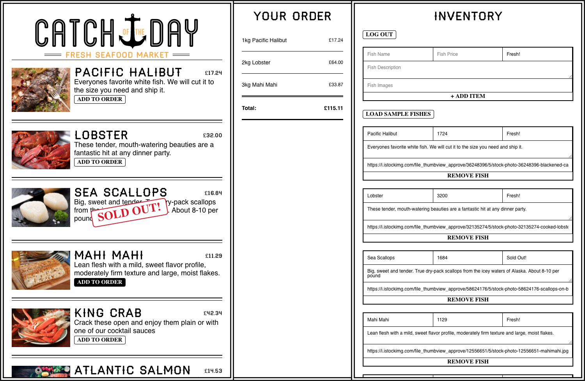

# Catch of the Day




## Introduction

Catch of the Day is a real-time app for a fictitious trendy seafood market where price and quantity available are variable and can change at a moment's notice. The app was built while completing [React for Beginners](https://reactforbeginners.com/), a React course by [Wes Bos](https://wesbos.com/).

The app is largely the same as the one you create in [React for Beginners](https://reactforbeginners.com/), but parts have been updated to support React 16, react-transition-group v.2x and re-base v.3x.


## Demo

A demo of the app can be found [here](https://catch-of-the-day-393cd.firebaseapp.com/).


## Project Features

- An entire app built using React
- create-react-app for Webpack Tooling
- Functional and class components, with markup written in JSX
- Application state management using a top-down data flow
- Communication between components using props
- Data persistence with HTML5 LocalStorage and Firebase Realtime Database
- Authentication with GitHub and Firebase Authentication
- JavaScript module for configuration and helper functions
- URL routing with React Router 4
- React animations using react-transition-group
- Takes advantage of ES2015 Features


## How to Use

### Develop

```sh
npm start
```

Runs the app in development mode.<br>
Open [http://localhost:3000](http://localhost:3000) to view it in the browser.

The page will automatically reload if you make changes to the code.<br>
You will see the build errors and lint warnings in the console.

### Deploy

```sh
npm run build
```

Builds the app for production to the `build` folder.<br>
It correctly bundles React in production mode and optimizes the build for the best performance.

The build is minified and the filenames include the hashes.<br>
By default, it also [includes a service worker](./docs/create-react-app-readme.md#making-a-progressive-web-app) so that the app loads from local cache on future visits.

### Firebase

Firebase configuration can be found in /src/rebase.js and uses [re-base](https://github.com/tylermcginnis/re-base) for data-binding between the application state and the Firebase Realtime Database.

Authentication is handled in the Inventory component, which uses re-base and connects to Firebase directly.

### More information

For more create-react-app commands, see the create-react-app [README](./docs/create-react-app-readme.md).


## Technology Used

What are the primary languages used for this project? Is there a framework in place? E.G.
- [React v.16.0.0](https://reactjs.org)
- [React Router v.4.2.2](https://reacttraining.com/react-router/)
- [re-base v.3.0.5](https://github.com/tylermcginnis/re-base)
- [Firebase](https://firebase.google.com/)


## Contributors

### Development

- Ashley Davis
